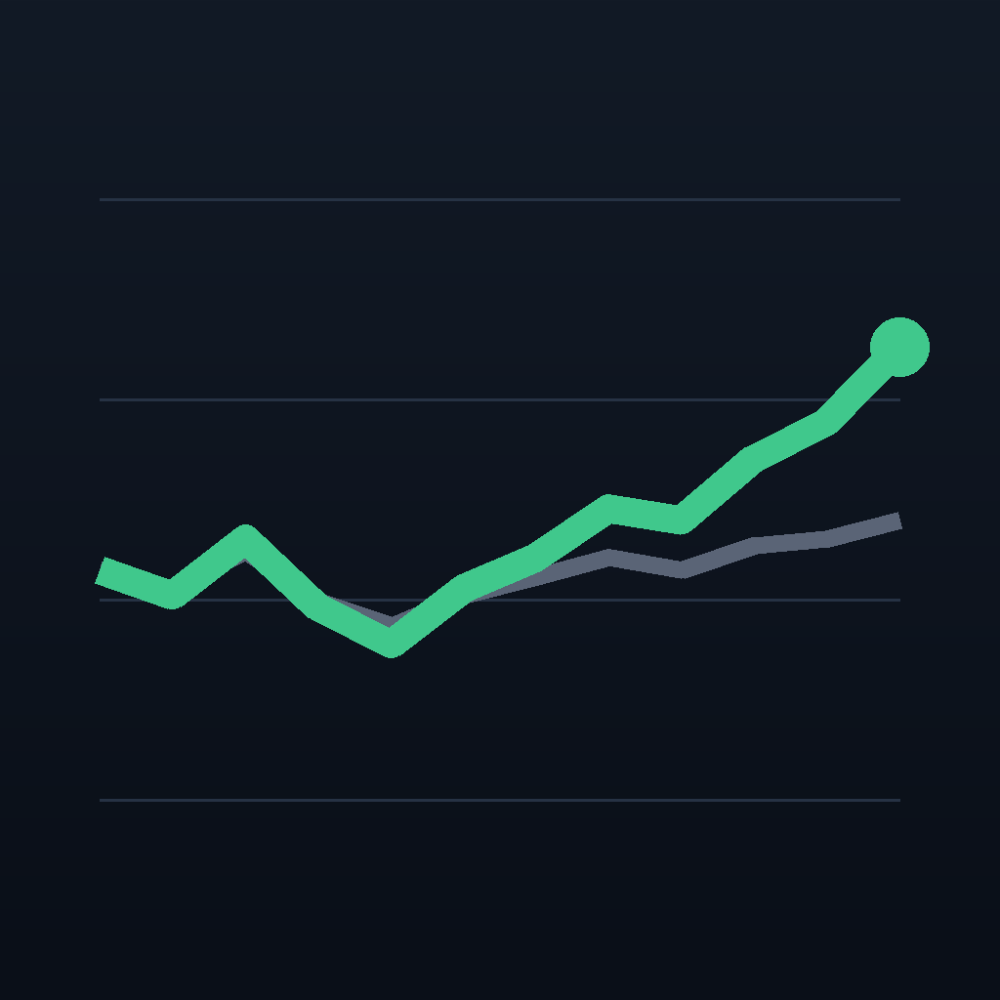

<p align="center"></p>

# 投资盘面 · options-desk

**掏出手机三秒，知道自己现在到底怎么样。**

    

前身死于静默——数据停在某一天，却没有任何东西报警。这一版把同步挂进每天必跑的复盘命令，并且要求「数据陈旧必须在界面上刺眼」：不新鲜的数字绝不冒充当前仓位。

## 它做什么

| 功能 | 说明 |
|---|---|
| **首屏只放改不了的三个数，和改得了的三个旋钮** | 累计收益、对 QQQ 的超额、最大回撤是结果，今天做什么都改不了；能动手的只有暴露和波动。所以首屏第三块是「现在的风险」：净暴露、融资杠杆、保证金余量——三个口径故意分开印，它们不是同一个问题。 |
| **一天三本账摞在同一天上** | 市场为什么这么走（市场读）、我当时怎么想（复盘正文）、我实际做了什么（券商成交）——分开看永远对不上，摞在一起才看得出「以为」和「做了」的差。 |
| **数据陈旧必须刺眼** | 前身死于静默：数据停在某一天，三个月没有任何东西报警。这一版把同步挂在每天必跑的复盘命令上，界面上的陈旧度条按交易日计算变色——不新鲜的数字绝不冒充当前仓位。 |
| **图上不许出现数据里没有的东西** | 样条会在两个真实收盘点之间画出不存在的起伏——改直线段；数据有洞时 Charts 会用直线把洞补平——改成按洞切段，断的地方真断。一个看得见的洞会让人去问为什么，一个假尖峰不会。 |

## 怎么拿到

个人专属（读的是本人账户），不开放安装。

只读盘面，数据来自私有后端 `desk.tianli.cyou`（访问闸后，读的是作者本人账户）。代码可读可编，没有账号跑不出数据。

## 构建

```bash
brew install xcodegen
xcodegen generate
xcodebuild -scheme OptionsDesk -destination 'generic/platform=iOS Simulator' build
```

- 仓里的 `*.sh` 是作者本机舰队脚本的 shim（三平台构建 / 真机装机 / TestFlight），依赖 `~/Dev` 下的总部工具，不在本仓；没有那套工具时它们会明确退出。
- `Shared/PlatformCompat.swift` 是总部共享文件的逐字节副本（iOS-only SwiftUI 修饰符在 macOS 侧的同名 no-op），别在这里改它。

开发细节（回归、验证通道、约束）见 [DEVELOPING.md](DEVELOPING.md)。

## 相关

- 产品页：<https://apps.tianli.cyou/p/options-desk-ios.html>
- 舰队总览（10 个 app 怎么来的）：<https://apps.tianli.cyou/ios.html>
- 教程：[从零到 TestFlight：一个人做 iPhone app 的完整路径](https://blog-ai.tianli.cyou/nine-ios-apps-in-two-weeks)

## License

MIT © 2026 曾田力 (Tianli Zeng)
